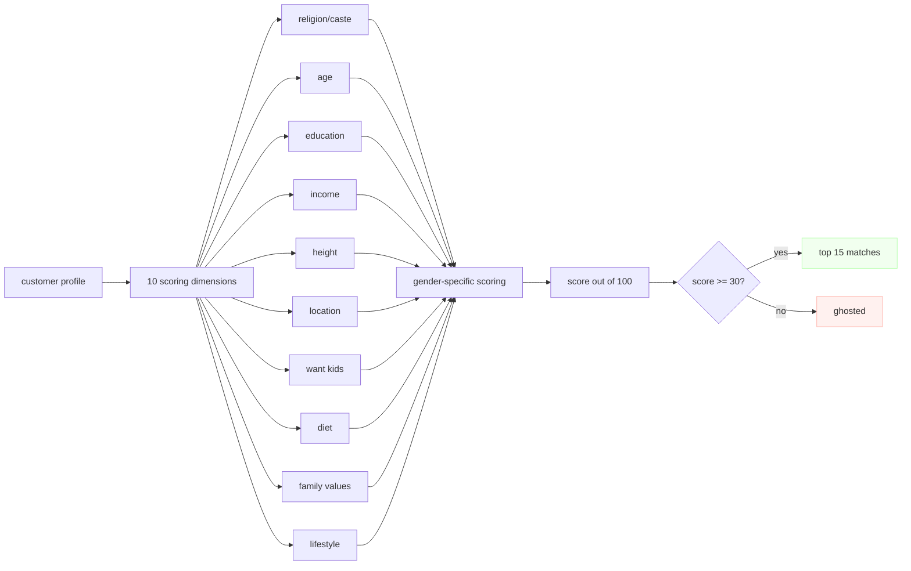

# tdc matchmaker dashboard

an internal tool for the date crew matchmakers. find your customers a perfect match without losing your mind (or your eyesight staring at spreadsheets).

## how matching works

the algorithm compares two profiles across 10 dimensions. each dimension has a weight — think of weights like how much your mom cares about each thing when she says "i found a nice boy/girl."

if you're a male customer, the system expects you to be older, taller, and richer than your match. if you're a female customer, it flips the script. sue us, we didn't make the rules — society did. (you can change all this from the scoring config page if you want to live dangerously.)



if a match scores below 30 out of 100, it gets thrown out. cold, we know. but you don't want to send your client on a date that's a 23/100 — that's just rude.

## the 10 dimensions (and what they actually mean)

| dimension | what it measures | why it matters |
|---|---|---|
| religion/caste | same religion? same caste? | aunties at the temple will ask |
| age | age gap + direction | "he's mature for his age" is a red flag at 15 years |
| education | degree level comparison | because "i'm a quick learner" isn't on the resume |
| income | who earns what | uncomfortable but we talk about it |
| height | who's taller | tinder showed us the data |
| location | same city? willing to move? | long distance is hard enough without the in-laws |
| want kids | yes, no, or maybe | "maybe" means "convince me" |
| diet | veg, non-veg, eggetarian, jain | dinner dates get awkward otherwise |
| family values | orthodox → liberal spectrum | how chill is your family at weddings |
| lifestyle | pets, drinking, smoking, family type | the small stuff that becomes big stuff |

## presets (so you don't have to think)

three built-in configs, adjustable from the scoring config page:

- **traditional indian** — religion/caste maxed out, age norms enforced, your grandparents would approve
- **modern / progressive** — caste matters less, education and vibes matter more, your therapist would approve
- **balanced** — somewhere in between, nobody fully approves but nobody's mad either

you can also go full custom mode and slide those weight sliders around like a dj at a wedding.

## what ai does around here

when you click "explain match" or "write intro," it calls meta-llama/llama-3.2-3b-instruct through openrouter. costs about as much as a single toffee per request. if the api key isn't set, it falls back to hardcoded text — which is about as romantic as a form letter, but hey, it works.

## quick start

```bash
git clone https://github.com/raptor7197/tdc-task.git
cd tdc-task
cp .env.example .env
# add your openrouter key if you want ai features
docker compose up -d --build
```

open http://localhost:3000 and log in with:

| email | password |
|---|---|
| priya@thedatecrew.com | tdc2024 |
| rahul@thedatecrew.com | tdc2024 |

## project layout

```
tdc-project/
├── server/                 # express api (profiles, matches, scoring, ai, notes)
│   ├── src/
│   │   ├── routes/         # one file per feature
│   │   ├── lib/            # matching algorithm, types, openrouter client
│   │   └── data/           # 120 fake profiles, matchmakers, scoring config
│   └── Dockerfile
├── client/                 # react + vite + tailwind
│   ├── src/
│   │   ├── pages/          # login, dashboard, customer detail, scoring config
│   │   ├── context/        # auth (frontend-only, no backend calls)
│   │   └── lib/            # api client, types, utils
│   ├── nginx.conf          # proxies /api/ to backend, serves spa
│   └── Dockerfile
├── docker-compose.yml      # spins up both containers
└── Dockerfile              # combined image (for render single-container deploy)
```

## things we chose not to build (yet)

- no database — 120 static profiles and in-memory notes are fine for an mvp. postgres can wait.
- no email sending — "send match" shows a toast and logs it. actual delivery needs sendgrid or similar.
- no real auth — login validates against hardcoded credentials in the frontend. don't put sensitive data here.
- no non-binary support — matching logic assumes male/female. we know. we'll get there.

## the one thing you should know before deploying

set `openrouter_api_key` in your `.env` file. without it, ai features return static text. with it, they return semi-intelligent text. your call.
